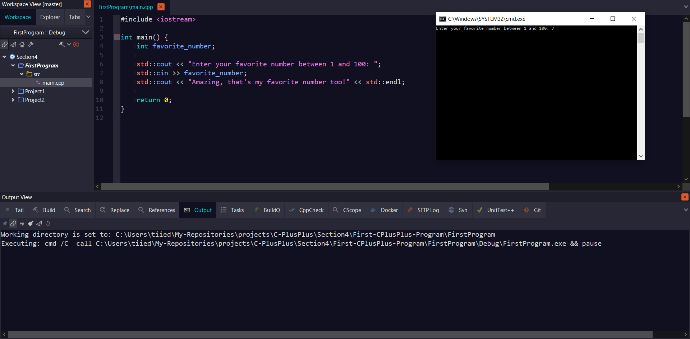

# First-CPlusPlus-Program

My very first step into coding with C++

making a very simple project which asks you your favorite number from 1 to 100, allows you to enter that number, and responds with a message.
